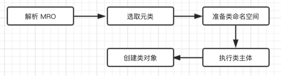
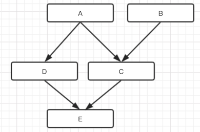

# Python - 高级教程 - 数据模型（4） - 元类与多继承

上一章节，我们了解了 `python` 中类的创建和类的基本的属性，本章节我们将主要讲解`元类与多继承`。

# 元类


默认情况下，类是使用 `type()` 来构建的。
元类就是 `Python` 中用来创建类的类。

类体会在一个新的命名空间内执行，类名会被局部绑定到 `type(name, bases, namespace)` 的结果。

类创建过程可通过在定义行传入 `metaclass` 关键字参数，或是通过继承一个包含此参数的现有类来进行定制。

在以下示例中，`MyClass` 和 `MySubclass` 都是 Meta 的实例:


```python
class Meta(type):
    # 继承了 type 作为元类
    pass

class MyClass(metaclass=Meta):
    # 显示指定元类 Meta
    pass

class MySubclass(MyClass):
    # 继承了父类，父类是元类
    pass
```


如之前所说， ```Human``` 是 `type` 类型，而 `Human`又是一个类，所以`type` 其实是一个用来创建类的类，即元类。

那么我们定义 `Human`  的过程，即 `type` 类创建 `type` 类型的实例的过程。

```python
Human1 = type("Human1", (object,), dict(name="", age="", sex=""))
```

通过内置关键字 `type`，通过参数`Human1` 作为类名，`object` 作为继承的父类，`dict()`作为创建类的成员变量，成功的创建了一个类`Human1`。


在类定义内指定的任何其他关键字参数都会在下面所描述的所有元类操作中进行传递。

> 当一个类定义被执行时，将发生以下步骤:
- 解析 MRO 条目；
- 确定适当的元类；
- 准备类命名空间；
- 执行类主体；
- 创建类对象。





## 解析 MRO 条目

MRO 即【方法解析顺序】（Method Resolution Order）。

此属性是由类组成的元组，在方法解析期间会基于它来查找基类。

### C3算法

`python` 在发展过程中，也不断的进化了它的 `MRO` 算法，当前是 `C3` 算法。
`C3` 算法保证了即使存在 '钻石形' 继承结构即有多条继承路径连到一个共同祖先也能保持正确的行为。

> C3 算法规则

以 class A(B,C) 为例：

- MRO(object) = [object]
- MRO(A(B, C)) = [A] + merge(MRO(B)， MRO(C), [B, C])

这里的关键在于 merge，其输入是一组列表，按照如下方式输出一个列表：

- 检查第一个列表的头元素（如 L[B] 的头），记作 H。
- 若 H 未出现在其它列表的尾部，则将其输出，并将其从所有列表中删除
- 否则，取出下一个列表的头部记作 H，继续该步骤
- 重复上述步骤:
- 如果是列表为空，则算法结束；
- 如果是不能再找出可以输出的元素，说明无法构建继承关系，Python 会抛出异常。


> 下面通过一个例子讲解 `C3` 算法查找继承父类的顺序列表是如何生成的。





```python
class A(object):
    pass

class B(object):
    pass

class C(A, B):
    pass

class D(A):
    pass

class E(D, C):
    pass

print(A.mro())
print(B.mro())
print(C.mro())
print(D.mro())
print(E.mro())
```


> 这里我们先不公布结果，先利用 `C3` 算法解析以下，是否与输出相同？


```python
- MRO(A) = [A] + merge(MRO(object))
         = [A, object]

- MRO(B) = [B] + merge(MRO(object))
         = [B, object]

- MRO(D(A)) = [D] + merge(MRO(A), [A])
            = [D] + merge([A, object], [A])
            # 此处 遍历 A，A出现在 [A] 中且是第一个，删除 A，并入 [D]
            = [D, A] + merge([object], [])
            # 此处 遍历 object， object 没有出现在其他列表中， 删除 object，并入[D, A]
            = [D, A, object] + merge([], [])
            # 列表为空
            = [D, A, object]
- MRO(C(A,B)) = [C] + merge(MRO(A), MRO(B), [A, B])
              = [C] + merge([A, object], [B, object], [A, B])
              # 此处 遍历 A， A 出现在 [A, B] 中且是第一个值，则 删除 A, 并入 [C]
              = [C, A] + merge([object], [B, object], [B])
              # 此处 遍历 object， object出现在 [B,object] 中，但不是第一个，继续遍历
              # 此处 遍历 B, B 出现在 [B] 中，且是第一个值， 则 删除 B, 并入 [C, A]
              = [C, A, B] + merge([object], [object], [])
              # 此处遍历 object， object 出现在第二个列表中，则删除 object, 并入 [C, A, B]
              = [C, A, B, object] + merge([], [], [])
              # 列表 为空
              = [C, A, B, object]
- MRO(E(D, C)) = [E] + merge(MRO(D), MRO(C), [D, C])
               = [E] + merge([D, A, object], [C, A, B, object], [D, C])
               # 此处遍历 D， D出现在 [D,C ] 中，且是第一个，删除 D，并入 [E]
               = [E, D] + merge([A, object], [C, A, B, object], [C])
               # 此处 遍历 A , A 出现在 [C, A, B, object] 中，但不是第一个，继续遍历
               # 此处 遍历 object， object出现在 [C, A, B, object] 中，但不是第一个，继续遍历
               # 此处 遍历 C，C 出现在 [c] 中且是第一个，删除 C, 并入 [E, D]
               = [E, D, C] + merge([A, object], [A, B, object], [])
               # 此处 遍历 A，A出现在 [A, B, object ] 中，且是第一个，删除 A， 并入 [E, D, C]
               = [E, D, C, A] + merge([object], [B, object], [])
               # 此处 遍历 object， object出现在 [B, object] 中，但不是第一个，继续遍历
               # 此处 遍历 B， B 没有出现在 其他列表中，删除 B，并入 [E, D, C, A]
               = [E, D, C, A, B] + merge([object], [object], [])
               = [E, D, C, A, B, object] + merge([], [], [])
               = [E, D, C, A, B, object]
```

最后的值为 ：

```shell
A = [A, object]
B = [B, object]
C = [C, A, B, object]
D = [D, A, object]
E = [E, D, C, A, B, object]
```

执行输出结果如下：

```shell
[<class '__main__.A'>, <class 'object'>]
[<class '__main__.B'>, <class 'object'>]
[<class '__main__.C'>, <class '__main__.A'>, <class '__main__.B'>, <class 'object'>]
[<class '__main__.D'>, <class '__main__.A'>, <class 'object'>]
[<class '__main__.E'>, <class '__main__.D'>, <class '__main__.C'>, <class '__main__.A'>, <class '__main__.B'>, <class 'object'>]
```


# 类的初始化

了解了类的创建是由 `type` 元类控制的，那么我们来看下自定义类是如何初始化一个对象的呢？

我们依旧沿用上面的例子，StrSub。

```python
class StrSub(str):
    def __init__(self, test):
        print("__init__ begin")
        self.test = test
        print(self.test)
        print("__init__ over")

    def __new__(cls, test):
        print("__new__ begin")
        print(cls)
        print(test)
        print("__new__ over")
        return super().__new__(cls, test)

if __name__ == "__main__":
    ss = StrSub("test")
```

```python
__new__ begin
<class '__main__.StrSub'>
test
__new__ over
__init__ begin
test
__init__ over
```

通过上面对 `__new__` 和 `__init__` 的了解，我们可以了解到类初始化的顺序。
关于`__new__` 和 `__init__` 的方法的说明，不了解的可以阅读上一章的内容。


所以说， `__new__` 是用来创建类实例的，而 `__init__` 是用来定制化 类实例的。

我们注意到 `__new__` 中使用了 `super().__new__` 方法来利用父类产生子对象。

```python
super().__new__(cls, test)
```

### super() 和 多继承

提到类的继承，就离不开多继承，就离不开父类。

其实单继承比较好理解，这里就不在赘述，我们来看下一个多继承的问题。

#### 多继承

先来看一个简单地多继承：


```python
class A(object):
    def __init__(self, a):
        print("A __init__ begin")
        self.a = a
        print("A __init__ end")

    def test(self):
        print("A test begin")
        print(self.a)
        print("A test end")


class B(object):
    def __init__(self, b):
        print("B __init__ begin")
        self.b = b
        print("B __init__ end")

    def test(self):
        print("B test begin")
        print(self.b)
        print("B test end")


class C(A, B):
    def __init__(self, a):
        print("C __init__ begin")
        A.a = a
        B.b = a
        super(C, self).__init__(a)
        print("C __init__ end")

    def __new__(cls, a):
        print("C __new__ begin")
        print(a)
        print("C __new__ end")
        return super().__new__(cls)

    def test(self):
        print("C test begin")
        print(self.a)
        print("C test end")


if __name__ == "__main__":
    c = C("c")
    d = C.mro()
    print(d)
    c.test()
```

```shell
C __new__ begin
c
C __new__ end
C __init__ begin
A __init__ begin
A __init__ end
C __init__ end
[<class '__main__.C'>, <class '__main__.A'>, <class '__main__.B'>, <class 'object'>]
C test begin
c
C test end
```

从运行结果可以很简单的看出，当


### 使用 `__new__` 的场景

我们需要定制一个类 `UpperStr`, 用来存储字符串，但是会将字符串自动转为大写的。

根据我们上面了解的 类 的常见过程，我们可以写出如下代码。

```python
class UpperStr(str):
    def __init__(self, string):
        print("__init__ begin")
        self.test = string
        print(self.test)
        print("__init__ over")

    def __new__(cls, string):
        print("__new__ begin")
        print(cls)
        print(string)
        print("__new__ over")
        string = string.upper()
        return super(UpperStr, cls).__new__(cls, string)


if __name__ == "__main__":
    ss = UpperStr("test")
    print(ss)
```

我们只需要在创建 str 对象之前，讲传入 str 的值使用 `upper()` 函数变为全大写拼写即可。

